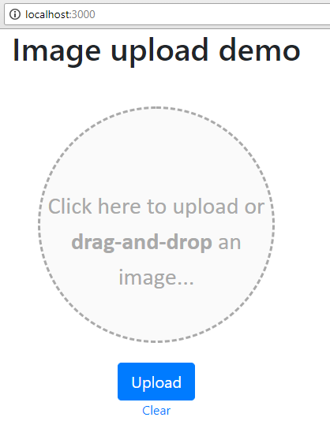

Hi there, how are you doing.

This post can be considered as a written version of my [YouTube mini-series](https://www.youtube.com/playlist?list=PL0-gUIpqQterKudDsYy8ogJ5pTSsYdwrv) on image upload end-to-end functionality.

All the code shown here is available in [this Github repo](https://github.com/ChaituKNag/image-upload-demo.git).

## Intention

The intention of this post and the corresponding YouTube playlist on image upload functionality is this:

### Why is this useful:

There are not many good tutorials on how to upload an image in a neat way. I thought it would be great to have a demo that includes this.

### What are some of the use-cases:

- Profile picture update.
- Image can be dragged and dropped into the placeholder and it shows a preview.
- Some custom validations to restrict users from uploading bigger size images
- Restrict users from uploading unwanted file-types.
- Showing error message and success message.
- Using Ajax to do all the heavy-lifting and avoid page reload for uploading the image.
- Have a simple back-end using express-js to simulate a real world upload scenario.
- Clear the selected file before upload, no reload needed.

## Technologies used

### In the front end:

- HTML5 for the markup
- JavaScript (ES5) for image related functionality
- jQuery just for the ajax functionality, you may use the plain old XHR or the recent ES6’s fetch as well. Good thing with a simple approach is that it is very easy to integrate into any framework.
- Bootstrap 4 for our UI styling. Not mandatory, you may use your own styles as well.

### In the back end:

- ExpressJS for the routes handling.
- NodeJS for saving the file and hosting the server.
- Bower for the front end dependencies like bootstrap and jQuery.
- Nodemon for continuous watching of file changes and auto-restart of node server.

## How to install

You should have NodeJS and Git installed in your machine. You can manage without Git, but I highly recommend you use it, so you can get exposure on that.

### Do a git clone

```bash
git clone https://github.com/ChaituKNag/image-upload-demo.git
```

### install

Go to that folder where you did the `git clone`.

```bash
npm install
# or
#npm i
```

### Install front-end dependencies

As we installed bower as an npm dependency, we can use the below function to install the bower front-end dependencies.

```bash
bower install
```

### Run the app

```bash
npm start
```

That is all required to get up and running.

### UI looks like this

Open http://localhost:3000.



## Front-end UI

Lets talk about the front end UI.

### Markup

The `index.html` file has the normal html5 boilerplate structure. The Bootstrap 4 related files such as `bootstrap.min.css`, `bootstrap.bundle.min.js` (which comes along with PopperJS included) and `jquery.min.js`. These are required for our fancy UI to use the Bootstrap 4 magic. Since we are using jQuery for our Ajax functionality, it is good that we included this over here.

There is a form which has a hidden input type of file. Its label surrounds it like this:

Notice the label surrounding the input:

```html
<form id="theImageForm">
  <label for="theImageField" id="theImageContainer">
    <input type="file" id="theImageField" accept="image/png, image/jpeg" />
    Click here to upload or <b>drag-and-drop</b> an image...
  </label>
  <p id="errorMessage" class="hide"></p>
  <p id="successMessage" class="hide"></p>
  <button class="btn btn-lg btn-primary" type="submit">Upload</button>
  <a href="" id="clearImage">Clear</a>
</form>
```

The reason for wrapping the input inside the label and hiding it is this:

- We want to stylize the label to look like a circular section where user can drop the image.
- We also want the same circular section to be clicked upon and the native file explorer window should pop-up. The label’s for attribute takes care of this.
- We need to hide the normal file input field, because it looks ugly for our purposes and it looks different in each browser, so for consistency sake, we should hide it.

The label has the `for` attribute pointing to the input which allows us to action upon the input field by clicking on the label (which is the case for all types of input fields). So, when we click on the circular section, we are actually clicking on the label and that in turn invokes the action upon the hidden input field.

Notice that there is this attribute `accept=”image/png, image/jpeg”` that makes sure that the user can only upload the images of type JPEG or PNG. Also, there is no attribute called multiple so the user can only upload one image file.

There are empty paragraphs to show error and success messages. There is an Upload button and a clear link to clear the selected image.

### Custom styling

Though we are using bootstrap framework, they can only do so much help and its up to us to customize our app to look the way we want.

> Even a superhero needs a haircut.

I’m using flex for centering the form. And the image container (label) is having the bulk of the styling.

To center the form:

```css
#theImageForm {
  display: flex;
  flex-direction: column;
  align-items: center;
  justify-content: center;
  margin-top: 50px;
}
```

The circular thingy:

```css
#theImageContainer {
  height: 300px;
  width: 300px;
  border: 3px dashed darkgray;
  background-color: #fafafa;
  font-family: "Calibri";
  font-size: 30px;
  text-align: center;
  vertical-align: middle;
  padding-top: 100px;
  color: darkgrey;
  cursor: pointer;
  border-radius: 50%;
  margin-bottom: 25px;
  position: relative;
  overflow: hidden;
}
```

The error and success messages:

```css
#errorMessage,
#successMessage {
  font-family: "Calibri";
  font-size: 18px;
  margin-bottom: 25px;
}

#errorMessage {
  color: red;
}

#successMessage {
  color: green;
}
```

To show the image preview, we use an image tag inside the circular label. But we need to make sure the image centers in that circle and the overflow should be hidden (taken care in the label related style).

```css
#theImageTag {
  position: absolute;
  top: -10px;
  left: 50%;
  width: 110%;
  transform: translateX(-50%);
}
```

Notice, we are using the traditional way of centering things using left and transform translateX stuff there.

We are also giving a special class called `.dragging` that gets added to the circular section when the image is being dragged onto it. Just extra border width and low opacity to the contained text.

That is it about the UI. The only place where we are using Bootstrap is when we style the button and to use a container (with a fixed width). And of course the fonts that come with Bootstrap look awesome as always.

## Front-end JavaScript

> Ooohh yes, JS…

Remember, there are no giant libraries to back us up with the heavy lifting. Its just **plain JavaScript**.

We just start with creating variables to all the sections:

All the pointers that we need:

```javascript
var theImageForm = document.querySelector("#theImageForm")
var theImageField = document.querySelector("#theImageField")
var theImageContainer = document.querySelector("#theImageContainer")
var theErrorMessage = document.querySelector("#errorMessage")
var theSuccessMessage = document.querySelector("#successMessage")
var theClearImageLink = document.querySelector("#clearImage")
```

### The parallel thoughts

There is a lot going on here.

We have to make sure we:

- allow user to drag and drop into the circular section
- allow user to click on the circular section and select the image
- allow user to clear the selected image
- allow user to submit the selected image
- have to handle drag and drop events to check for file type and size
- have to change style of the circular section when the image is being dragged

### The process of dragging

This is obviously the most important and intuitive part of this app. But it is equally tricky to make sure you don’t do errors while handling the dragging scenario.

First, you have to prevent the default thing that happens when you drag a file onto a browser which is to load the file as a static file in the window.

For that you have to add a special listener that cancels out such static loading as soon as that event occurs. And this has to be listening to all the drag and drop related events.

Preventing the default action…:

```javascript
;[
  "drag",
  "dragstart",
  "dragend",
  "dragover",
  "dragenter",
  "dragleave",
  "drop",
].forEach(function (dragEvent) {
  theImageContainer.addEventListener(dragEvent, preventDragDefault)
})
```

Then comes the hover effect that comes when the user is dragging the file onto the circular section, we have to add the `.dragging` class. We do that like this:

The `dragenter` and `dragover` events happen when the file is being dragged over to the circular section. The `dragleave` and `dragend` events happen when the file is being pulled away from the section. The `drop` event obviously happens when the file is let go on the section.

UI changes while dragging:

```javascript
;["dragover", "dragenter"].forEach(function (dragEvent) {
  theImageContainer.addEventListener(dragEvent, function () {
    theImageContainer.classList.add("dragging")
  })
})
;["dragleave", "dragend", "drop"].forEach(function (dragEvent) {
  theImageContainer.addEventListener(dragEvent, function () {
    theImageContainer.classList.remove("dragging")
  })
})
```

The hover effect:


And then finally when the user drops the file, we need to make sure the file goes through a size-check and file-type check.

There is another listener to `drop` event (remember? we can assign multiple listeners to DOM events). The `checkFileProperties` function takes care of the file-size and file-type checks. If there is an issue, it will gracefully complain using the `#errorMessage` paragraph and end the drop event handler. Also, we are restricting the dragged files to be only one.

```javascript
theImageContainer.addEventListener("drop", function (e) {
  if (e.dataTransfer.files.length > 1) {
    theErrorMessage.innerHTML = "Drag only one file..."
    theErrorMessage.classList.remove("hide")
    return false
  }
  var theFile = e.dataTransfer.files[0]
  theImageField.files[0] = theFile

  if (checkFileProperties(theFile)) {
    handleUploadedFile(theFile)
  }
})
```

Max file size is 500KB:

```javascript
function checkFileProperties(theFile) {
  theErrorMessage.classList.add("hide")
  theSuccessMessage.classList.add("hide")

  if (theFile.type !== "image/png" && theFile.type !== "image/jpeg") {
    console.log("File type mismatch")
    theErrorMessage.innerHTML = "File type should be png or jpg/jpeg..."
    theErrorMessage.classList.remove("hide")
    return false
  }

  if (theFile.size > 500000) {
    console.log("File too large")
    theErrorMessage.innerHTML = "File too large, cannot be more than 500KB..."
    theErrorMessage.classList.remove("hide")
    return false
  }

  return true
}
```

We are restricting the file size to be less than or equal to 500KB and of type JPEG or PNG. The file has type and size properties that give us this info.

### Selecting the file manually

But what if the user manually clicks on the circular section and manually selects the image instead of dragging. For that we will get a change event being triggered on the hidden input field. We need to handle that as well like this:

The `event.target.files` property gives the list of files the user has selected.

The same functionality for both dragging and selecting manually:

```javascript
theImageField.onchange = function (e) {
  var theFile = e.target.files[0]

  if (checkFileProperties(theFile)) {
    handleUploadedFile(theFile)
  }
}
```

### Image preview inside circular section

The `handleUploadedFile` function takes care of previewing the uploaded image. This is done using a FileReader constructor which is coming from JavaScript’s DOM api.

Previewing the image:

```javascript
function handleUploadedFile(file) {
  fileName = file.name
  clearImage()
  var img = document.createElement("img")
  img.setAttribute("id", "theImageTag")
  img.file = file
  theImageContainer.appendChild(img)

  var reader = new FileReader()
  reader.onload = (function (aImg) {
    return function (e) {
      aImg.src = e.target.result
    }
  })(img)
  reader.readAsDataURL(file)
}
```

This `FileReader` reads the file and triggers a `load` event when it is done reading. We are setting the image source to be the `event.target.result`.

This takes care of previewing the image.

### Submitting the image to the back-end

When user clicks on the button, the uploaded image gets sent to the backed in a base64 string format.

This is important to note, because there are many ways that we can send files to the back-end but for images, I think base64 formatted string is a quick and easy way.

```javascript
theImageForm.onsubmit = function (e) {
  e.preventDefault()
  var theImageTag = document.querySelector("#theImageTag")
  jQuery
    .ajax({
      method: "POST",
      url: "/upload",
      data: {
        theFile: theImageTag.getAttribute("src"),
        name: fileName,
      },
    })
    .done(function (resp) {
      if (resp === "UPLOADED") {
        theSuccessMessage.innerHTML = "Image uploaded successfully"
        theSuccessMessage.classList.remove("hide")
      }
    })
}
```

The Ajax call also sends the name of the file which we are getting from the `handleUploadedFile` method. The base64 string is sent in the property named “theFile”.

Once the upload is successful, we show the success message.

### Clearing

If the selected image has to be cleared for some reason, user can click on the **Clear** link below the button.

The function looks like this:

```javascript
function clearImage(e) {
  if (e) {
    e.preventDefault()
  }

  var theImageTag = document.querySelector("#theImageTag")

  if (theImageTag) {
    theImageContainer.removeChild(theImageTag)
    theImageField.value = null
  }

  theErrorMessage.classList.add("hide")
  theSuccessMessage.classList.add("hide")
}
```

We remove the manually added image so that the background text shows up again.

## Back-end JavaScript

The history of backend can be easily marked as “Before NodeJS” and “After NodeJS”. Of course there is still a lot of competition out there from the likes of Python, Java and PHP but in its relatively short life-time, NodeJS has touched every average developer’s life in some way or the other. (Trying not to get emotional here 😜).

We use NodeJS for this example too. We use it for our packaging and server support. Packaging allows us to use many beautiful applications built on NodeJS such as bower, expressJs and the likes.

### What do we use:

1. NodeJS for sure.
2. ExpressJS for routing and body-parser to parse incoming Ajax requests
3. Bower for front-end dependency management
4. Nodemon — to watch our files and auto-restart Node.

All the imports:

```javascript
const express = require("express")
const fs = require("fs")
const bodyParser = require("body-parser")
const app = express()
const appPort = process.env.PORT || 3000
```

### What is routing

When we talk about the back-end, there is always a good chance that we are trying to build a micro-service or some sort of RESTful API that the front-end is going to use, right!

ExpressJS and its routing features allow us to build seamless API with its middleware functions. We can target various request types and RESTful paths. Also we can target route-params (though we are not covering them here).

### Building the back-end

There is only one single file that caters all of our needs here, since this is a very simple demo as far as back-end is concerned.

In that file, we

- Build our API route to handle the upload scenario.
- Bring up the server to host the front-end as well as the back-end.
- Handle the uploaded file by saving it in the “images” folder.

### API route for uplading

We import the express module and build our `app`. Then we bring up the server using `app.listen` function.

The app listens on port 3000 or the PORT variable on the environment.

```javascript
app.listen(process.env.PORT || 3000, () => {
  console.log(`The server is up and running on ${appPort} port.`)
})
```

Then we create the required routing using the app.post method of the ExpressJS API.

```javascript
app.post("/upload", (req, res) => {
  if (req.body.theFile !== "") {
    let theFileString = req.body.theFile
    let theFileName = req.body.name
    theFileString = theFileString.replace(/data:image\/(png|jpeg);base64,/, "")
    fs.writeFileSync("images/" + theFileName, theFileString, {
      encoding: "base64",
    })
  }

  res.send("UPLOADED")
})
```

A lot is going on here, lets just take a step back and analize.

- The API URL is specified as the first parameter to the `.post` method. It is `/upload`.
- The second argument is the function that gets called back when this particular route is targeted through a `post` call.
- When the function gets executed, the first two arguments are request object (`req`) and response object (`res`) respectively.
- The request object as usual contains the body object that contains all the data that is being sent from the front-end.
- In that body object, we can find the `theFile` property that contains our base64 encoded string of image data.
- We check for that property’s existence and get both the encoded string and the title of the image to save it inside the file that we are going to save it as.
- Then we writ the file to the “images” folder, using the NodeJS’s built-in `fs.writeFileSync` method.
- Notice that in this method we are passing the encoding also in the options object. This is to ensure that the file is being written in the proper format.
- At last, we use the response object to send a simple “UPLOADED” string to the front-end to notify that the upload worked fine.

### Static loading

In order to serve the front-end files, we are putting them inside a folder called `public`. To make the NodeJS app server serve those files as they are, we use the `express.static` method like below.

We are also serving the bower_components in the `/libs` route.

```javascript
app.use("/libs", express.static("bower_components"))
app.use(express.static("public"))
app.use(
  bodyParser({
    limit: "1mb",
  })
)
app.use(bodyParser.json()) // for parsing application/json
app.use(bodyParser.urlencoded({ extended: true })) // for parsing application/x-www-form-urlencoded
```

### Limiting file-size and encoding incoming requests

We are using `body-parser` in order to do some middleware changes.

- We can call the imported `bodyParser` function with an options object and the main option here is `limit` which we are setting to `1mb`.
- Also, we are converting all incoming request data to JSON format using `bodyParser.json` method.
- We are also using the `bodyParser.urlencoded` method to read the encoded data that sometimes comes through.

## The conclusion

I hope you liked this post and gained some knowledge out of it. I have created a [YouTube series](https://www.youtube.com/playlist?list=PL0-gUIpqQterKudDsYy8ogJ5pTSsYdwrv) demonstrating this illustrated example demo.

Please subscribe to my [YouTube channel](https://www.youtube.com/channel/UCl5dc2m9rRGZsAu04ytfDjw) and follow me here as well.

See you soon with more tutorials and tips.

> Originally posted in Medium [here](https://medium.com/@nagachaitanyakonada/image-upload-functionality-cd497a5bba54).
