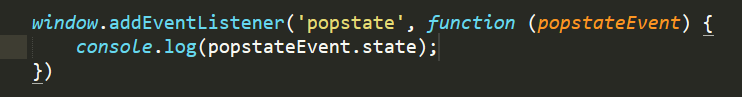
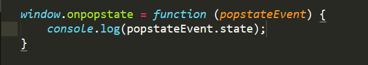
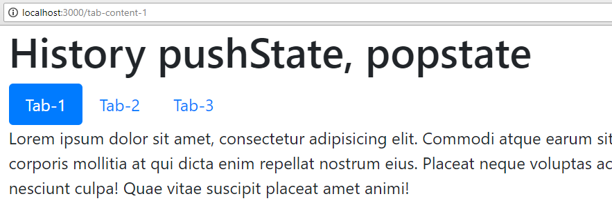
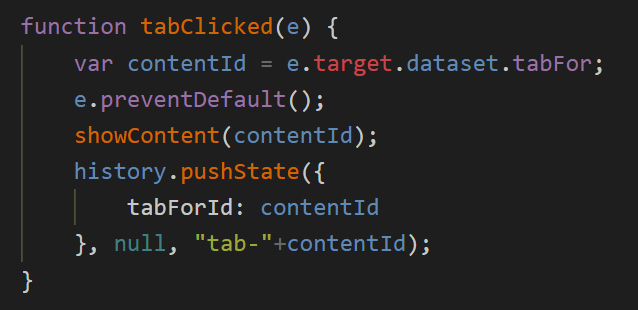
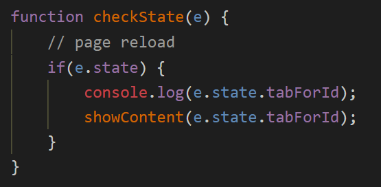
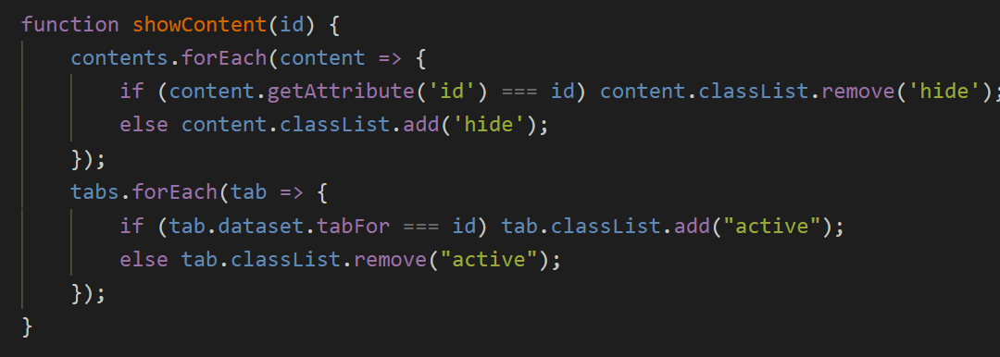
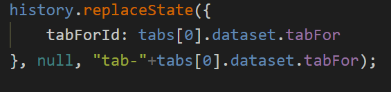

Hey there, how are you doing.

> This is a transcript to [my youtube tutorial](https://youtu.be/klhY5c6TwUg) on JavaScript history pushState functionality.

All the code that I explain here is available in [this Github repo](https://github.com/ChaituKNag/youtube-demos__history-state-demo).

---

## What is window.history

Here is what MDN says:

> The Window.history read-only property returns a reference to the History object, which provides an interface for manipulating the browser session history (pages visited in the tab or frame that the current page is loaded in).

Every time you click on a link in a web-page or a hashtag within the page, a history entry gets recorded in the browser session.

## What is history.pushState

Essentially, history.pushState method on the history object can be used to create and activate a new history entry manually. There is another method called history.replaceState, which actually replaces the immediate last entry into the history of the browser session. Using both these methods, we can associate arbitrary data to the history entries that they create and access that data when the user goes to that particular entry point at a later time.

You can mention a title of the history entry by passing it to the second parameter to the function.

And then the optional third parameter is a URL that will get replaced with in the address bar as soon as user navigates to that particular entry.

## What about hashtags

Using hash tags, you can achieve creating a new history entry by doing two things. You can manually set `window.location = "#content-1"` or you can give the static anchor tags' href attribute a value something like this `href="#content-1"` and clicking on that link will create the new history entry as well as update the URL with that hash-tag.

## The event popstate

We have an event called popstate, that occurs when user goes back to a history entry point that was created manually using `history.pushState` or `history.replaceState`. This event gets fired on the window object of the DOM.

You can listen to this event by adding an event listener on the window:



or using the window.onpopstate property:



> Note that pushState() never causes a hashchange event to be fired, even if the new URL differs from the old URL only in its hash.

## Other methods in window.history

There are some other methods which can be used to navigate back and forth in the history of the browser page, namely:

- `history.back()` — goes back one step
- `history.forward()` — goes forward one step
- `history.go()` — goes back or forth in the history depending on the parameter, which is an integer which can also be negative.

Alright, enough with the introduction. Lets see an example.

---

## Example

In our example, we will have a page with 3 tabs, each having an associated paragraph content. When we click on any particular tab, the corresponding content shows up and the URL reflects the tab that was clicked.



To illustrate this example, I’m creating a local project in which the server side is built up using ExpressJS (of course, with the help of NodeJS) and the client side with plain JavaScript.

### The server.js file

This creates the simple backend for our example.

```javascript
const express = require("express")
const path = require("path")

const app = express()

app.use(express.static(path.resolve(__dirname + "/public")))

app.get("*", (req, res) => {
  res.sendFile(path.resolve(__dirname + "/public/index.html"))
})

app.listen(3000, () => {
  console.log("The app has started at port 3000")
})
```

Here, the app runs on port 3000, captures all static requests to the public folder and sends those files. It also captures all other requests and redirects to the `index.html` file.

### The client side app.js file

This is where all our client side magic happens. We are having a listener bound to the click events on the tabs.

Each tab is having a `data-tab-for` attribute that holds the ID of the associated paragraph.



When the tab is clicked, we are getting the `contentId` and adding a manual entry into the history using `history.pushState()`. Notice, as a first argument, we are passing an object that has `tabForId` same as the `contentId` of the clicked tab. This object is called the **state**. Saving this enables us to retrieve it when the user navigates back to this entry of the history.

Notice the third argument which is `"tab-"+contentId` and translates to `http://localhost:3000/tab-content-1` if the ID is content-1.

### Reading the pushed state

When the popstate event happens on the window, we are calling a function called `checkState` which takes the popstate event object. This object has a state property that contains the original object that we passed to pushState method while creating this history entry. So we can how conveniently access the tabForId from this event object like this: `event.state.tabForId` to retrieve the ID of the paragraph to show.

Then we will simply show that paragraph and hide the remaining paragraphs.





To listen to the popstate event, we simply have to do this:

`window.onpopstate = checkState;`

### When the page loads

There is a problem that arises when the pushState arbitrarily updates the URL, if the backend is listening to URL changes and the user reloads the same page at the point where the URL got updated.

To prevent any issues, we can check the state on page load and replace the empty state with a new state with the first tab ID so that when the user manually refreshes the window, the first tab content is shown and the URL also reflects the same.

This piece of code takes care of it:



And here is the complete code of the client side app.js file:

```javascript
var tabs = document.querySelectorAll("a[data-tab-for]")
var contents = document.querySelectorAll(".content>p")

tabs.forEach(tab => tab.addEventListener("click", tabClicked))
window.onpopstate = checkState

history.replaceState(
  {
    tabForId: tabs[0].dataset.tabFor,
  },
  null,
  "tab-" + tabs[0].dataset.tabFor
)

function showContent(id) {
  contents.forEach(content => {
    if (content.getAttribute("id") === id) content.classList.remove("hide")
    else content.classList.add("hide")
  })
  tabs.forEach(tab => {
    if (tab.dataset.tabFor === id) tab.classList.add("active")
    else tab.classList.remove("active")
  })
}

function tabClicked(e) {
  var contentId = e.target.dataset.tabFor
  e.preventDefault()
  showContent(contentId)
  history.pushState(
    {
      tabForId: contentId,
    },
    null,
    "tab-" + contentId
  )
}

function checkState(e) {
  // page reload
  if (e.state) {
    console.log(e.state.tabForId)
    showContent(e.state.tabForId)
  }
}
```

## Conclusion

Those who get intrigued by the routing concepts and wanted to create their own little routing plugin in plain JavaScript get the most out of this little tutorial.

I hope you liked this. Subscribe to my [Youtube channel](https://www.youtube.com/channel/UCl5dc2m9rRGZsAu04ytfDjw) and follow me in Medium to get more helpful tips and tutorials on the wonderful platform of web-development.
