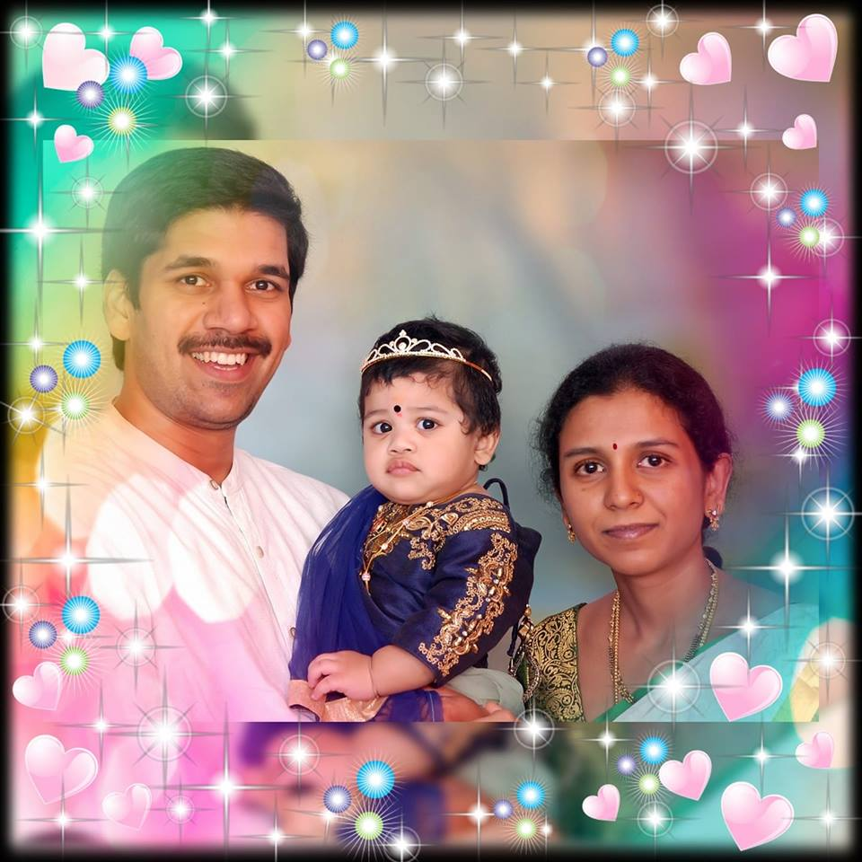

## Intro

Hey how is it going.

Many times in the past, I thought there is never going to be a day in my life such as this one.

I mean so much happiness and excitement on the one side and a total void on the other. Why the void, you might ask? Let me explain.

## The beginning

> We are all humans and we do mistakes, we learn from them, then try not to repeat them, then miserably repeat them and fall down like dried leaves of a dying tree.

I come from a small town in eastern coast of Andhra Pradesh, India called [Tuni](https://en.wikipedia.org/wiki/Tuni). That was a different world, now that I even go back into those incredible memories. My thoughts deepen, my legs feel the chill and nostalgia filled heart, whenever I go through those memories.

Ok, so I studied till my plus-two there in that town and went on to pursue my B.Tech in [Kakinada](https://en.wikipedia.org/wiki/Kakinada). I met my current ongoing future there. High-tech lifestyle, prospective opportunities, dream-filled faces and what not, it was a miracle how my life ended up there and eventually here.

The college showed me the path to technical career and I got campus-placed in one of the biggest corporate giants in India, soon to join the office as a rookie in the garden city of India, [Bangalore](https://en.wikipedia.org/wiki/Bangalore).

## The career

> Life is a race, everybody tries hard to win. But race is only a part of life, there are lives that beg you to stop and listen and cherish the moments.

Got married in the first year of my professional career. There are no plans, no complicated strategies towards budgeting, planning and implementing them. I went with my family as the wind takes the flavor.

Knowledge in technologies like Java, JavaScript, CSS, HTML strenthened, I grew as a web-developer with backend programming experience. I worked on creating eCommerse and sales web-sites such as large US banks.

I changed the city, changed the company, this time it is [Hyderabad](https://en.wikipedia.org/wiki/Hyderabad) and the company is one of the biggest mutual fund companies of US.

I found peace, amid all the turmoil that was going on all around. Cool people, bundles of joy, table tennis. In house projects, cool code-releases, scrum meetings, morning coffees, innovative hackathons... these were the routine there. Heaven could have been dull before this.

My first kid was born. Life slowed down to a graceful smooth ride. Started feeling the father-sense, the love only a father can have towards his family. Care that cannot be explained, but it is to be experienced. I knew, the man in me is finally maturing. It all started making sense.

Career picked up pace, new technologies are swirling all around, people again trying to catch the wind, shouts everywhere, fancy things started in office, funny behaviors, unexpected new friends, shouts, cries, hatred, bromance, all filled the mind with memories.

Yet...!!!

That day came after 5 years when I had to say, enough is enough. This is a grown-up man now, who wants to step up and stand-by his family. No more take-it-easy strategy. I resigned.

## The current

My third company is the perfect place for a person like me. Full of innovative thinking, never to be seen communication strategy, networking, open minded people all over. Huge community of geeks, nerds and fun-bombs.

Serious turn of my career, cool and energetic stuff happening every minute, keeping myself busy and yet productive, fun and vision running side by side.

Not to brag, but the latest best thing that happened to my life and family is this new workplace. My mind opened up, no more relaxing, no more missing out on all the cool innovation and fun.

> It continues, life.

