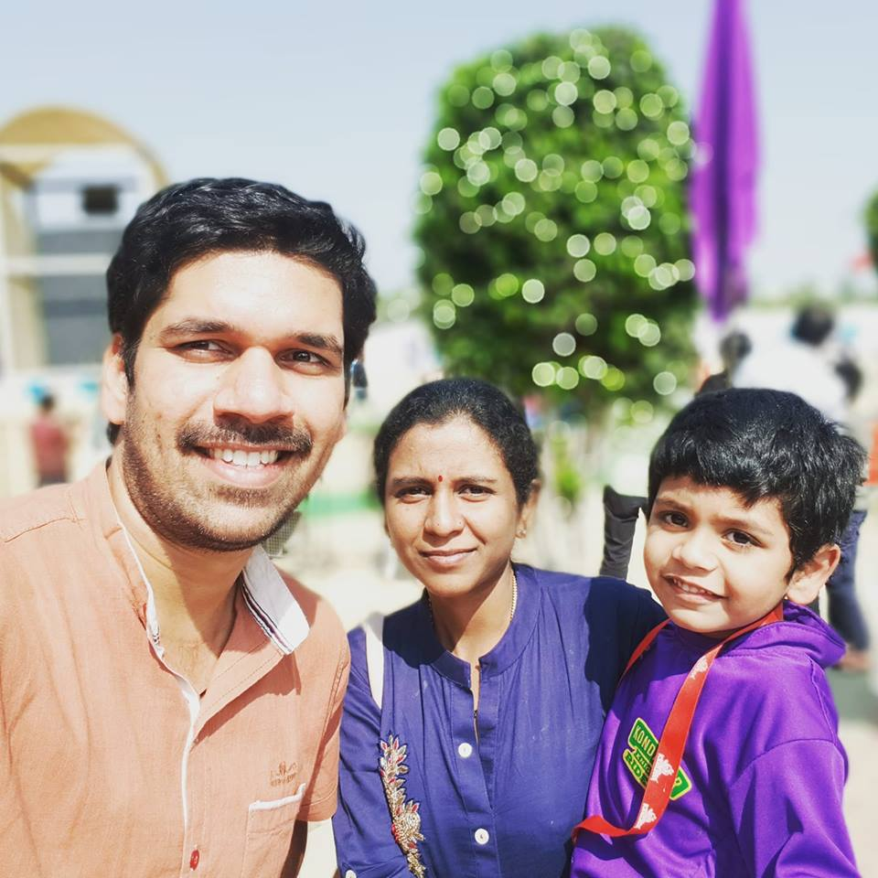

On Monday 28th January morning, I suffered great pain in the lower back towards my left side.

I got up as usual on that day, getting ready to go to office, but as I just brushed my teeth and walked towards the Deewan, all of a sudden, I felt the pain and collapsed on the Deewan itself.

Only after sometime passed that my wife realized the severity of the issue, because I generally tend to lay down on the bed for sometime before kickstarting the day. But I decided to take the day off at office.

I informed others at office as well about the condition.

## How severe

At one point I could not even go to the wash room because I could not get up from the Deewan. I was not even able to turn around. I had to use my upper body strength to even slightly move the body.

I stayed still till the evening, only getting up in the afternoon to have some food and go to bathroom once in the middle.

In the evening at 4pm, my wife rushed me to Mythri hospital in Ashok Nagar (Chandanagar) in Ola Auto and I got admitted in the Out-patient ward and they immediately tested my condition and advised an X-ray test.

The sister gave me a pain-killer injection on the back (ironically the injection itself was painful) and then I went for the X-Ray. The technician there positioned me in front-on and sideways positions and after some time I was moved to the waiting area for doctor visit. At 6pm the doctor came.

## What happened

This was no bone-fracture or bone-related issue at all. It was but a muscle tear issue (muscle got torn near the spine), this generally would happen if I did some heavy-lifting or heavy work just before that.

But as I remembered, I never did any such thing. So, this came down to either

- Bad sleeping posture
- While tongue-cleaning that morning I might have done the coughing up of waste in a rigorous way that might have accidentally triggered the muscle tear.
- My elder kid (Tamoghna) sometimes plays on my back, even to the extent of jumping on the lower part when I sleep facing down.
- A combination of all the above along with sitting postures issue at workplace. Though, I highly doubt about the sitting posture, as I take good care of my back during worktime and I move around quite a lot especially in my new workplace.

So, anyway we came home after being prescribed some muscle relaxing medicine and Volini pain relief cream. Most importantly, I need bed-rest for atleast a week.

I should say, this is the first time I have had that kind of severe pain in the lower back and not being able to even change my posture in the bed for the next 24 hours or so.

I am slowly recovering from the issue but on the second and third days, for some weird reason, my motions went out of control (went loose) and I went more than 10 times to the bathroom on the second and third days. So, today (30th Jan), we again went to the same doctor to understand if this is due to the prescribed medicines. He gave some other medicine as well.

My wife, funnily told that doctor and the people in the OP room on Monday, all kinds of made-up reasons why I might have got the issue in the first place:

- That I don't eat rice anymore and so because of imbalanced diet.
- That I eat a lot of biscuits in an attempt to quench my hunger.
- That I might have an issue with my kidneys due to the diet.
- That I lost too much weight and so I got this issue.

All of the people including the doctor dismissed the assumptions. She even suggested the doctor to prescribe a kidney check-up during the second visit for which the doctor said there is no such need.

**Poor lady.**

When the sister checked my BP on Monday it was _120/80_, first time that I noticed the normal BP after all these years. I attribute this normality in BP to the **stricter diet** and **continual jogging sessions** that I am doing these days.

So, after the doctor visit on Monday, I decided to give myself some rest this week. So, leave at office, I informed the concerned team.

> Friends, take care of your backs, don't allow any pressure on your backs while playing with kids or lifting heavy stuff (even kids) and during any daily activity that involves heavy things.

